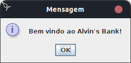
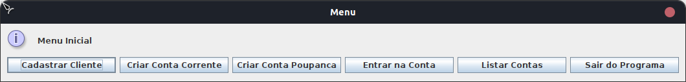
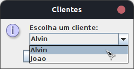
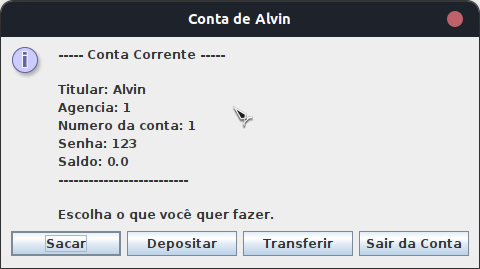
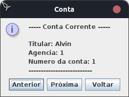
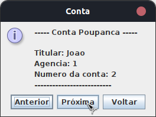

# Criando um Banco Digital com Java e Orientação a Objetos

## 📜 Informações do Desafio

 Considerando nosso conhecimento no domínio bancário, iremos abstrair uma solução Orientada a Objetos em Java. Para isso, vamos interpretar o seguinte cenário: “Um banco oferece aos seus clientes dois tipos de contas (corrente e poupança), as quais possuem as funcionalidades de depósito, saque e transferência (entre contas da própria instituição).”

## 📖 Conceitos Aplicados

 <h3>Abstração</h3>
 Habilidade de concentrar-se nos aspectos essenciais de um domínio, ignorando características menos importantes ou acidentais. Nesse contexto, objetos são abstrações de entidades existentes no domínio em questão.

 <h3>Encapsulamento</h3>
 Encapsular significa esconder a implementação dos objetos, criando assim interfaces de uso mais concisas e fáceis de usar/entender. O encapsulamento favorece principalmente dois aspectos de um sistema: a manutenção e a evolução.

 <h3>Herança</h3>
 Permite que você defina uma classe filha que reutiliza (herda), estende ou modifica o comportamento de uma classe pai. A classe cujos membros são herdados é chamada de classe base. A classe que herda os membros da classe base é chamada de classe derivada.

 <h3>Polimorfismo</h3>
 Capacidade de um objeto poder ser referenciado de várias formas, ou seja, é capacidade de tratar objetos criados a partir das classes específicas como objetos de uma classe genérica. Cuidado, polimorfismo não quer dizer que o objeto fica se transformando, muito pelo contrário, um objeto nasce de um tipo e morre daquele tipo, o que pode mudar é a maneira como nos referimos a ele.

## 🆙 O que foi implementado

 - <h4>Interface básica com JOptionPane</h4>
 - <h4>Utilização do Lombok</h4>
 - <h4>Validação de todos os campos</h4>
 - <h4>Tratamento de Exceções</h4>
 - <h4>Sistema de Login</h4>
 - <h4>Listagem dinâmica de contas</h4>

## ❓ Sobre o projeto

 Um sistema de Banco Digital no qual é baseado no cadastro de clientes e criação de contas. A partir disso cada conta pode fazer saque, depósito e transferência.

 O sistema não deixa o usuario criar uma conta sem existir clientes cadastrados e também não consegue transferir para outra conta caso não exista.

 As validações dos campos de inserção e interação foram feitas para permitir que o sistema funcionasse evitando o máximo possível de falhas.

### Algumas Imagens do Sistema

 |  |  |
 |:---:|:---:|
 | **Welcome** | **Menu** |

 |  |  |
 |:---:|:---:|
 | **Select** | **Conta** |

 |  |  |
 |:---:|:---:|
 | **Lista1** | **Lista2** |

### 🎥 Vídeo Mostrando o Funcionamento do Sistema

https://github.com/c-Alvinn/dio-java-desafio-banco-digital/assets/141906500/4c19eb74-bec5-4f2c-b132-b7f00a11dcba

### 📲 Como clonar este projeto

````bash
    # Select where you want to clone
    $ cd ~/Documents/WHERE_YOU_WANT
````

````bash
    # Clone the project
    $ git clone https://github.com/c-Alvinn/dio-java-desafio-banco-digital.git
````

````bash
    # Check if cloning worked fine
    $ cd ~/Documents/DIRECTORY_LOCATION
    $ ls
````
